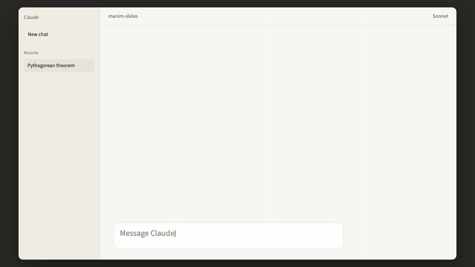

# Manim-Slides MCP Server
<div align="center">

[](https://glama.ai/mcp/servers/antoniomachuca/MCP-Manim-Slides)
[](https://github.com/antoniomachuca/MCP-Manim-Slides/releases)
[](https://www.python.org/)
[](https://opensource.org/licenses/MIT)
[](https://github.com/astral-sh/ruff)
[](https://github.com/antoniomachuca/MCP-Manim-Slides/actions)


</div>
MCP server that lets an agent write Manim-Slides scenes, render them, and compile the deck from the same session.

## Demo

A Claude Desktop session asks for a short Pythagorean theorem deck. The view zooms into the prompt as it is typed, then pulls back as the agent calls `math_derivation`, `execute_manim_code`, and `sync_deck`. `serve_revealjs_html` opens the browser on the rendered Manim deck and plays the animations.



## Features

- `execute_manim_code` writes the script, runs `manim-slides render`, and returns the media paths. Syntax errors fail before a subprocess starts. stdout, stderr, and tracebacks go back to the client.
- Render progress is reported with `notifications/progress` as frames complete.
- Each scene is cached by a hash of the shared preamble, the class source, and the quality flag. Changing one scene leaves the others in `.render_cache`.
- `sync_deck` renders new or changed scenes, restores the rest from cache, reports removed scenes, and runs `manim-slides convert` in the same call.
- Prompt templates `title_slide`, `agenda`, `code_walkthrough`, `math_derivation`, and `two_column_comparison` expand a few arguments into layout and code instructions.
- `compile_presentation` and `export_revealjs_html` build Reveal.js HTML, PDF, PPTX, or a zip, including theme, transition, and offline options.
- `export_video` joins slide media into one MP4. Still images get a fixed duration. `transition` is `none` or a crossfade.
- `preview_slide` extracts one slide as an image, a short MP4, or a GIF. `contact_sheet` montages one frame per slide with FFmpeg. `screenshot_deck` captures a Reveal.js deck headlessly (optional `vision` extra).
- `serve_revealjs_html` hosts the deck on a local port. `stop_preview_server` shuts that server down.
- `list_scenes` and the `slides://list` resource read rendered scene metadata from the workspace.

## Prerequisites

Ensure your system has the following installed:

- Python 3.10+
- [uv](https://docs.astral.sh/uv/) (dependency and environment management)
- [Manim Community Edition](https://docs.manim.community/en/stable/installation.html) (Requires FFmpeg and LaTeX)
- [Manim-Slides](https://manim-slides.eertmans.be/latest/installation.html)

## Installation

```bash
git clone https://github.com/antoniomachuca/MCP-Manim-Slides.git
cd MCP-Manim-Slides

# Install uv if needed: https://docs.astral.sh/uv/getting-started/installation/

# Create the environment and install the project plus dev dependencies
uv sync --extra dev

# Optional: enable deck screenshots (screenshot_deck) via the vision extra
uv sync --extra dev --extra vision
playwright install chromium
```

The `vision` extra (or `pip install "mcp-manim-slides[vision]"` for pip users) adds [Playwright](https://playwright.dev/python/), which `screenshot_deck` needs to capture deck slides headlessly; run `playwright install chromium` once afterwards to download the browser binary. Every other tool — rendering, caching, syncing, compiling, exporting video, and contact sheets — works without it.

## Configuration

To integrate this server with an MCP-compatible client (e.g., Claude Desktop, Cursor, Antigravity), add the following to your client configuration JSON:

```json
{
  "mcpServers": {
    "manim-slides": {
      "command": "/absolute/path/to/MCP-Manim-Slides/.venv/bin/python",
      "args": [
        "/absolute/path/to/MCP-Manim-Slides/mcp_manim_slides/server.py"
      ],
      "env": {
        "WORKSPACE_DIR": "/path/to/your/output/directory"
      }
    }
  }
}
```

## Available MCP Tools & Resources

### Tools (`@mcp.tool`)
- `hello_world(name: str = "World")`: Connectivity check tool to verify client-server MCP communication.
- `execute_manim_code(code: str, scenes: list[str] | None = None, quality: str = "l", media_dir: str | None = None, timeout: int = 600, use_cache: bool = True)`: Writes the provided Manim code to a secure temporary script, renders the scenes headlessly via `manim-slides render`, and returns paths to produced media files. Caches rendered output per scene by a content hash of the shared preamble, the scene class source, and `quality`, so editing one scene never invalidates its siblings; only changed scenes are re-rendered unless `use_cache=False`.
- `sync_deck(code: str, scenes: list[str] | None = None, dest: str = "deck.html", folder: str = "slides", quality: str = "l", output_format: str = "auto", config: dict[str, str] | None = None, one_file: bool = False, media_dir: str | None = None, workspace_dir: str | None = None, timeout: int = 600)`: Renders changed scenes and recompiles the deck in a single call. Compares per-scene content hashes against the render cache and the last successful sync state, renders only new or changed scenes, restores unchanged ones from cache, reports removed scenes, then recompiles the presentation with `manim-slides convert`.
- `compile_presentation(scenes: list[str], dest: str, folder: str = "slides", output_format: str = "auto", config: dict[str, str] | None = None, one_file: bool = False, workspace_dir: str | None = None, timeout: int = 300)`: Compiles rendered slide assets into an interactive presentation via `manim-slides convert` (supports `html`/Reveal.js, `pdf`, `pptx`, `zip`, custom Reveal.js themes and transition configs).
- `export_revealjs_html(scenes: list[str], dest: str, folder: str = "slides", theme: str = "black", transition: str = "none", transition_speed: str = "default", controls: bool = False, progress: bool = False, slide_number: bool = False, hash: bool = False, loop: bool = False, title: str | None = None, config: dict[str, str] | None = None, one_file: bool = False, offline: bool = False, workspace_dir: str | None = None, timeout: int = 300)`: First-class Reveal.js HTML export via `manim-slides convert --to html`, with typed configuration for themes, transitions, navigation controls, slide numbers, deep linking, looping, and offline/one-file embedding.
- `export_video(scenes: list[str], dest: str = "presentation.mp4", folder: str = "slides", workspace_dir: str | None = None, fps: int = 30, width: int | None = None, height: int | None = None, transition: str = "none", transition_duration: float = 0.5, image_duration: float = 2.0, timeout: int = 600)`: Concatenates slide media across scenes into a single MP4 video with FFmpeg. Each slide is normalized to a common frame size and rate (still images become fixed-duration segments) and joined with the concat demuxer (`transition="none"`) or an xfade crossfade chain (`transition="fade"`).
- `preview_slide(scene: str, slide_index: int = 0, output_format: str = "png", folder: str = "slides", workspace_dir: str | None = None, timeout: int = 120)`: Extracts a single slide preview (image frame `png`/`jpg`/`webp`, video snippet `mp4`, or animated `gif`) via FFmpeg for rapid visual validation without compiling the full presentation.
- `screenshot_deck(dest: str, workspace_dir: str | None = None, slides: list[int] | None = None, output_dir: str = "screenshots", width: int = 1920, height: int = 1080, output_format: str = "png", timeout: int = 120)`: Captures screenshots of an exported Reveal.js deck's slides headlessly via Playwright (optional `vision` extra), so an AI agent can "see" its own deck. Serves the deck directory on the local HTTP server and saves one image per slide.
- `contact_sheet(scenes: list[str] | None = None, dest: str = "contact_sheet.png", folder: str = "slides", workspace_dir: str | None = None, columns: int = 3, tile_width: int = 640, timeout: int = 300)`: Composes a grid contact sheet of slide frames using FFmpeg only — one representative frame per slide, montaged into a single image (black filler tiles complete the last row) — so an entire deck can be reviewed at a glance without a browser.
- `list_scenes(folder: str = "slides", workspace_dir: str | None = None)`: Discovers and lists all rendered scenes, slide counts, and metadata available in the workspace.
- `serve_revealjs_html(dest: str, workspace_dir: str | None = None, host: str = "127.0.0.1", port: int | None = None, open_browser: bool = True)`: Serves an exported Reveal.js HTML deck on an ephemeral local HTTP server for one-click browser preview. Returns the preview URL and optionally opens it in the default browser.
- `stop_preview_server(port: int | None = None)`: Stops a running ephemeral preview server by port, or all preview servers when no port is given.

### Resources (`@mcp.resource`)
- `status://server`: Telemetry resource returning current server status, Python version, and environment details.
- `revealjs://config`: Lists supported Reveal.js HTML export options (themes, transitions, transition speeds, boolean toggles, and defaults).
- `slides://list`: Resource listing all rendered slide configurations and metadata in the active workspace.

## Prompts (`@mcp.prompt`)

Slide-archetype prompt templates that expand a few arguments into complete instructions (content, layout guidance, typography, slide mechanics, and a suggested code skeleton) for generating Manim-Slides code:

- `title_slide(title: str, subtitle: str = "", author: str = "")`: Opening title slide with a dominant title and optional subtitle and author lines.
- `agenda(topics: str)`: Agenda slide listing the presentation topics as a numbered list; `topics` is a comma-separated string (e.g. `"Intro, Demo, Results"`).
- `code_walkthrough(code: str, title: str = "")`: Narrates a real code snippet step-by-step across several slides; `code` is embedded verbatim and `title` is an optional heading.
- `math_derivation(steps: str, title: str = "")`: Reveals a math derivation one step per slide; `steps` is a comma-separated list of LaTeX steps (e.g. `"f(x) = x^2, f'(x) = 2x"`).
- `two_column_comparison(left_title: str, right_title: str, left_points: str, right_points: str)`: Side-by-side comparison slide with two titled columns; points are comma-separated strings.

## License

This project is licensed under the MIT License.
